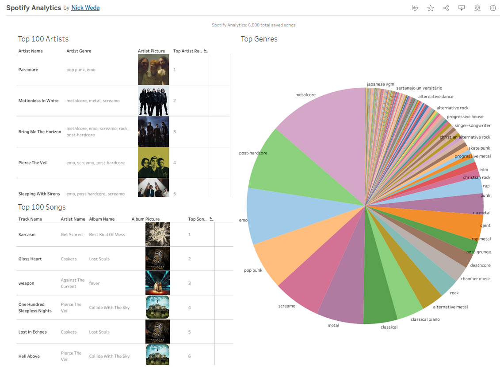
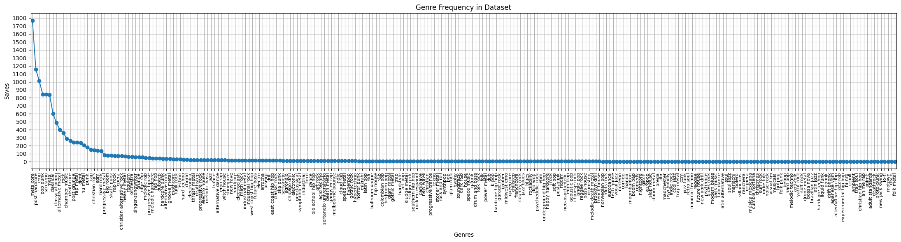
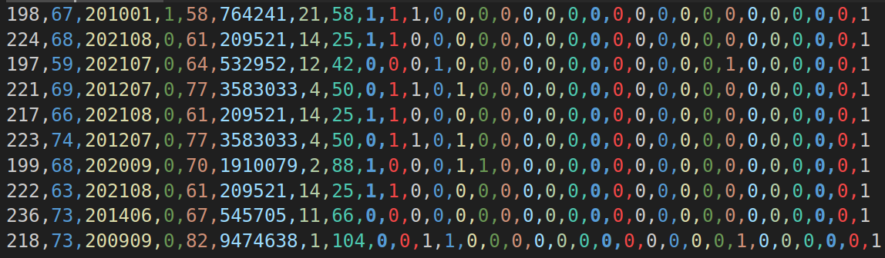
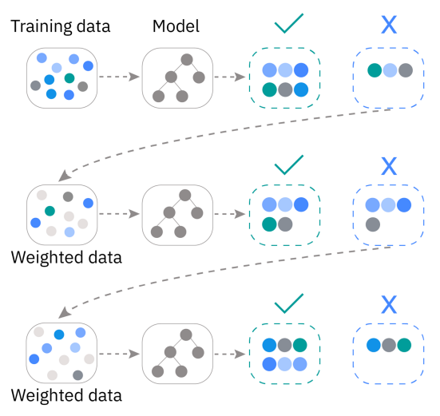

# Nick's Music Taste - Spotify Data Analysis and building a Machine Learning Model

This Project is and ***end-to-end*** self inspired Data Science project, where I source my own personal Spotify song data using an API, and use the data to construct an Analytics Dashboard and build a Machine Learning Model which can predict if an unseen song will be among my top favorited songs.

The motivation behind this project is to do a self-analysis and learn more about my music preferences, and find out how likely I will be to liking new music. 

## Data Sourcing - Data Engineering
- Spotify provides a [Web API](https://developer.spotify.com/documentation/web-api) to request all of your saved song Data
- The [SpotiPy](https://github.com/spotipy-dev/spotipy) library provides a Python interface to this API 

## Building a Dataset - Data Engineering

### Track (Song) Data

- We can query the API for a list of all of our saved (liked) tracks on Spotify. 
- This list comes with a Top Track ranking attached to each song, from the most favorite to the least favorite saved song.
- In my case I had **6,418 saved songs**.

### Artist Data

- A list of our Top Artists can be queired from the API, which provides more in-depth information about the Artist.
- There are **578 Top Artists** in my list
- However, not all artists in our saved song list will belong to the Top Artists.
- To get further information about the other artists, we directly call the API for *each* other Artist not in the Top Arist list.

### Combined Features
- track_name, track_duration, track_explicit, track_album, track_release_date, track_global_popularity, track_album_name, track_album_photo_url, **track_top_songs_ranking**
- artist_name, artist_genre, artist_global_popularity, artist_follower_count, artist_photo_url, artist_top_artist_ranking

The data was parsed from it's original JSON format, stored in a CSV, then imported into a **SQLite** database.

## Data Analysis/Visualization with Tableau - Data Analysis
Using Tableau, I visualized:
- Top Songs
- Top Artists
- Top Genres

[Tableau Dashboard](https://public.tableau.com/views/SpotifyAnalytics_17534101939520/Dashboard1?:language=en-US&:sid=&:redirect=auth&:display_count=n&:origin=viz_share_link)

## Data Wrangling with Pandas - Data Science

To lay the foundation for a Machine Learning model, the dataset must be modified to fit the numerical input that a Decision Tree model expects to see.

### Simple Modifications
- Use the DateTime library to parse the track release date and return a solid integer
- Parse the track duration from MM:SS to just seconds

### Drop and Replace Text Features
- Dropping Album Name, closely tied to the artist, redundant information (the exception is that in some rare cases an artist's style will change radically over time/albums)
- Drop Track Name, due to it's high cardinality/uniqueness in the dataset
- Dropping Artist Name, replacing it with the frequency of artist appearances in the dataset

(Investigating the Semantic Meaning behind the Artist/Track name and it's relation to genre, therefore relation to preference is an interesting NLP research question)

### Finding Top Genres and One-Hot encoding them
- In total, there are **252 unique genres** in the dataset
- However, intuition tells me that these are not uniformally distributed
- I used matplotlib to map the frequency of genres
- 
- There is a clear elbow at genres that have 80 or more occurances, which cuts off the rest of the genres that appear to be close to uniformally distributed
- There are 22 genres (8.7% of total genres) that dominate over the others
- With these genres having such prominence, I suspect that they have a strong tie to the target variable, and should be preserved
- Issue: Genre's are stored in a List, they need to be stored as a single numeric value
- The best way to do this is to one-hot encode the top 22 genres (adds significant width (columns) to dataset, which lightgbm will be fit to handle)

### Transforming the Target Variable
- The Top Songs Ranking ranges from [1, 6,418]
- The question I would like to answer is: **Given a new song, will it be in the top 10% of my Top Songs?**
- This is easily interpretable, and can be modified to include a different range of favorites (e.g. 25%, 50%, etc.)
- A regression would also work, however, a song being predicted to be my e.g. 4,212nd favorite song does not have a lot of meaning to me
- I transformed the label to be binary, where 1 means it is in the top 10%, and 0 means it is not in the top 10%

This creates the following dataset containg the features:
- track_duration, track_popularity, track_release_date, track_explicit, artist_popularity, artist_follower_count, artist_ranking, artist_freq, genre_* (* - all 22 genres)

## Building an ML Model - Data Science

- Test two different Ensemble Decision Tree Models, **XGBoost** and **Lightgbm**
- I defined my train/test splits to be stratified, as the target variable transformation skews the data to be imbalanced
- Between XGBoost and Lightgbm, they both score a high 92% and 93% accuracy respectively.
- However, Lightgbm scores a higher **precision** score, with lower False Positive counts,
- I believe this to be because Lightgbm handles higher dimensional (more columns) data better than XGBoost

### Analyzing False Positives and Negatives
- I sent the false positives and negatives from the model testing to respective CSV files
- On analysis of False Positives, they are songs from my favorite artists that are popular, that I don't necessarily dislike, but aren't my favorite from them
- This confusion is valid, I do like these songs and artists, but the element of subjectivity that the model can't capture is missing
- On Analysis of False Negatives, a lot of these songs are newer songs from my favorite artists, or they are from new artists. I believe the release date and artist popularity features are suspect to this.
- There are also some anomalies, such as John Mayer and Beethoven, as they don't fit my genre norm but I greatly appreciate

Note: The Spotify API used to provide additonal track information, which are features about the actual tonality of the track. Such as danceability, loudness, energy, etc. The inclusion of these features I believe would lead to a significantly higher accuracy and overall model quality/generalizability. 

## Placing the Model in a System/Application for use - Machine Learning Engineering
