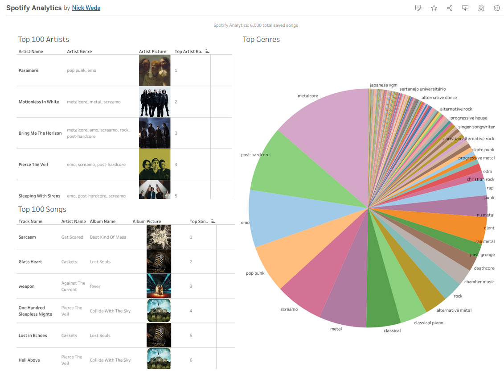

# Nick's Music Taste - Spotify Data Analysis and building a Machine Learning Model

This Project is and ***end-to-end*** self inspired Data Science project, where I source my own personal Spotify song data using an API, and use the data to construct an Analytics Dashboard and build a Machine Learning Model which can predict if an unseen song will be among my top favorited songs.

The motivation behind this project is to do a self-analysis and learn more about my music preferences, and find out how likely I will be to liking new music. 

## Data Sourcing - Data Engineering
- Spotify provides a [Web API](https://developer.spotify.com/documentation/web-api) to request all of your saved song Data
- The [SpotiPy](https://github.com/spotipy-dev/spotipy) library provides a Python interface to this API 

## Building a Dataset - Data Engineering

### Track (Song) Data

- We can query the API for a list of all of our saved (liked) tracks on Spotify. 
- This list comes with a Top Track ranking attached to each song, from the most favorite to the least favorite saved song.
- In my case I had **6,418 saved songs**.

### Artist Data

- A list of our Top Artists can be queired from the API, which provides more in-depth information about the Artist.
- There are **578 Top Artists** in my list
- However, not all artists in our saved song list will belong to the Top Artists.
- To get further information about the other artists, we directly call the API for *each* other Artist not in the Top Arist list.

### Combined Features
- track_name, track_duration, track_explicit, track_album, track_release_date, track_global_popularity, track_album_name, track_album_photo_url, **track_top_songs_ranking**
- artist_name, artist_genre, artist_global_popularity, artist_follower_count, artist_photo_url, artist_top_artist_ranking

The data was parsed from it's original JSON format, stored in a CSV, then imported into a **SQLite** database.

## Data Analysis/Visualization with Tableau - Data Analysis
Using Tableau, I visualized:
- Top Songs
- Top Artists
- Top Genres

[Tableau Dashboard](https://public.tableau.com/views/SpotifyAnalytics_17534101939520/Dashboard1?:language=en-US&:sid=&:redirect=auth&:display_count=n&:origin=viz_share_link)

## Data Wrangling with Pandas - Data Science
To lay the foundation for a Machine Learning model, the dataset must be modified to fit the numerical input that a Decision Tree model expects to see.

### Simple Modifications
- Use the DateTime library to parse the track release date and return a solid integer
- Parse the track duration from MM:SS to just seconds

### Drop and Replace Text Features
- Dropping Album Name, closely tied to the artist, redundant information (the exception is that in some rare cases an artist's style will change radically over time/albums)
- Drop Track Name, due to it's high cardinality/uniqueness in the dataset
- Dropping Artist Name, replacing it with the frequency of artist appearances in the dataset

(Investigating the Semantic Meaning behind the Artist/Track name and it's relation to genre, therefore relation to preference is an interesting NLP research question)

### Finding Top Genre's and One-Hot encoding them
- In total, there are **252 unique genres** in the dataset
- However, intuition tells me that these are not uniformally distributed
- 

## Building an ML Model - Data Science

## Testing Predictions - Data Science / Software Engineering
